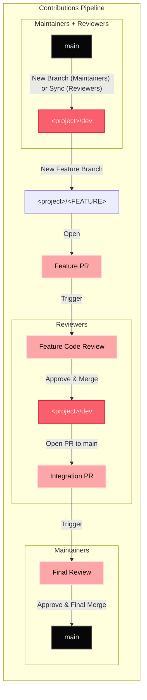
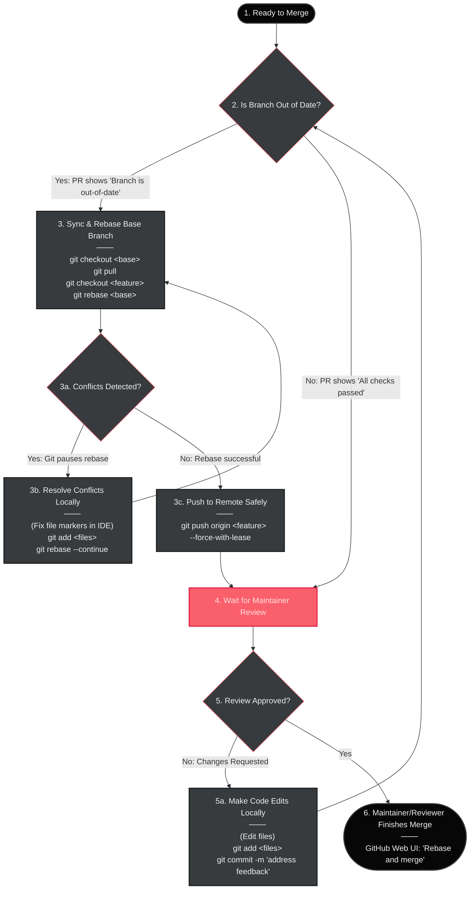

# UGVC-Rover-26

This is the monorepo for our participation in the UGVC 2026 competition organized by ICMTC in Egypt.

## Contributing

### Project Navigation

This is a monorepo. Every folder at the monorepo root level is considered a separate subproject.

#### Opening a project

It is **not** recommended to directly open the monorepo root folder in your text editor or IDE. Please open the subproject folder for the project you are working on.

#### Project list

| Project                 | Base Branch        | Description                                                             |
|-------------------------|--------------------|-------------------------------------------------------------------------|
| [Monorepo](./)           | `main` | structuring of the monorepo                                             |
| [console](./console/)   | `console/dev`      | GUI for remote control                                                  |
| [firmware](./firmware/) | `firmware/dev`     | firmware for the on-board MCUs                                          |
| [network](./network/)   | `network/dev`      | configuration and scripts for network setup                             |
| [reports](./reports/)   | `reports/dev`      | deliverable documents required by the competition                       |
| [rover_ws](./rover_ws/) | `ros/dev`          | ROS2 project for on-board control, navigation, vision and communication |
| [field](./field/)       | `field/dev`      | firmware & configuration for on-field devices, ex: router & killswitch  |


### Branch Strategies

Below is a graph demonstrating the branch strategies for the each of the subprojects as `<project>` and for the root-level changes. 



#### Merge Strategy

When merging from `<feature>` into `<base>` ensure linear history.

This can be best achieved by rebasing on `<base>` before merging:
```sh
(on <feature>)$ git rebase <base>
```

According to the previous branch strategy diagram, you should follow these guidelines when merging from `<project>/<FEATURE>` into `<project>/dev` and when merging from `<project>/dev` into `main`.

Here is a detailed merge workflow that accounts for the processes of pull request reviewing, resolving conflicts and rebasing before merging:




### Cross-project Work

Since this is a monorepo, simultaneously updating different subprojects (e.g `rover_ws` and `console`) will require pulling and merging more than one branch at a time.

To follow the branch and merge strategies, use the following method to help in doing so.

#### Multiple Clones | Git Worktrees [↗️](https://git-scm.com/docs/git-worktree)

You can clone the repo more than once if you are a reviewer or maintainer working on more than one branch at a time.

Git worktrees work as a direct alternative to cloning the repo twice to work on multiple branches in parallel.

Under the monorepo root folder `UGVC-Rover-26` run:
```sh
git worktree add ../UGVC-Rover-26-WT-[Reason] <branch-name>
```

Replace `[Reason]` with a short, descriptive name you can refer to later. Replace `<branch-name>` with the other branch you want to work on in parallel. Append `-b` to the command if you want to create a new branch with name `branch-name`.

You can now treat `UGVC-Rover-26-WT-[Reason]` as a new clone of the monorepo, and open the subproject folder from it in your favorite text editor or IDE.

#### Single Feature Branch for Multiple Subprojects (Discouraged)

When time is tight, you may create a branch called `feature/<FEATURE>` from one of the subprojects you are working on. Then start a pull request for that subproject and inform the reviewers of the other subprojects to review and `git cherry-pick` your relevant commits into their branch.